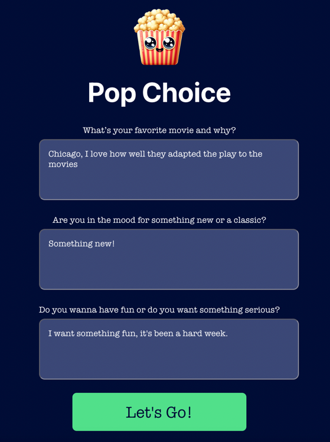

# Pop Choice
#### An AI powered movie recommendation tool. (WIP)

### Tech used
- React
- Supabase
- OpenAI

To run the app, first run `nvm use` in the terminal, then `npm i` to update dependencies.
Afterward, `npm run dev` will get the app up and running in the browswer. 

Don't forget to add your environment variables, `/server/.env.example`
will be where you can copy and populate them locally.

